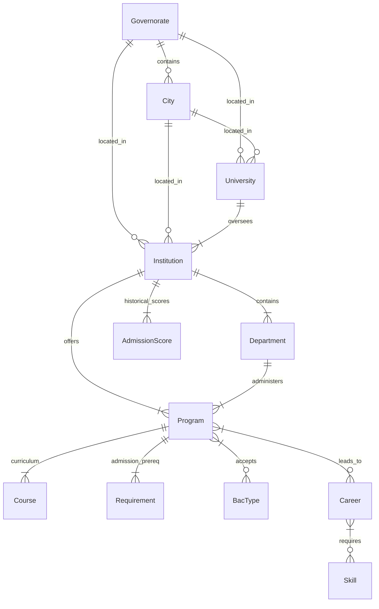

# Entity Relationship Diagram (ERD)

This document contains a Mermaid entity-relationship diagram representing the schema of the Tunisian Higher Education Orientation Knowledge Base.

## Relationships Descriptions

1. **Governorate & City / University / Institution**: Spatial clustering hierarchy. Every university and institution is pinned to a specific city and governorate for spatial analysis and region-based recommendations.
2. **University & Institution**: 1-to-many relationship mapping schools/faculties/institutes under their overarching parent university.
3. **Institution & Department**: Split of studies within the faculty or institute.
4. **Program**: The fundamental unit of study offering degrees (e.g. License, Engineering degree).
5. **Course (Curriculum)**: Semester-by-semester courses forming the curriculum.
6. **Career & Skills**: Career mapping linking orientations to real jobs, with salary ranges and soft/hard skills.
